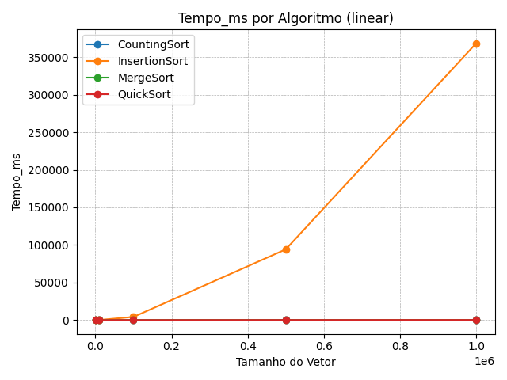
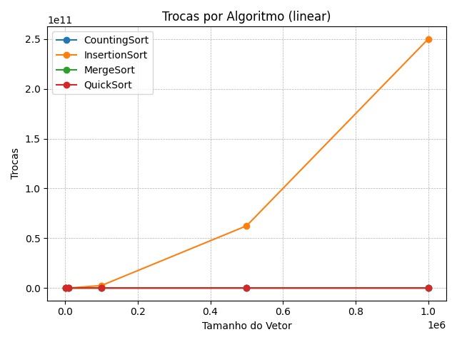
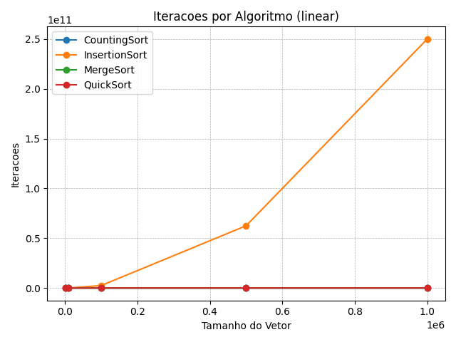
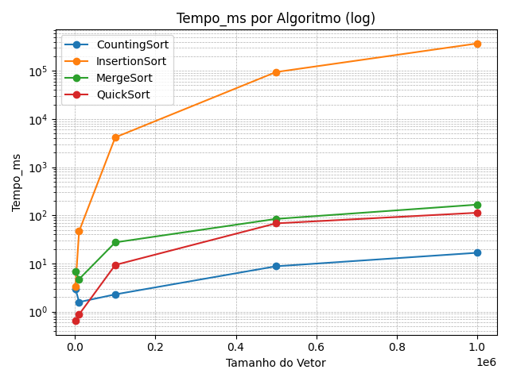
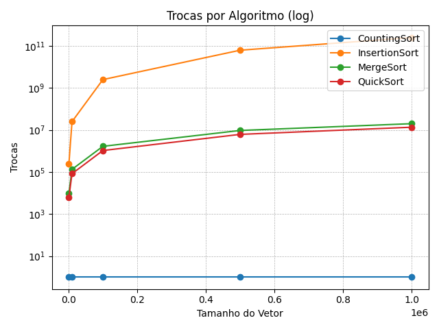
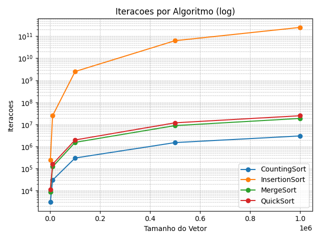

# RELATÓRIO DE ORDENAÇÃO COM GRÁFICOS E TABELAS: Análise de Desempenho

Este repositório contém os resultados de diferentes algoritmos de ordenação (InsertionSort, MergeSort, QuickSort e CountingSort) avaliados em vetores de tamanhos variados. Foi desenvolvido um script em Python (`gerar_graficos.py`) que processa os arquivos CSV de saída, calcula médias de tempo de execução, número de trocas e número de iterações, e gera gráficos em escala *linear* e *logarítmica*.

---

## 1. Estrutura das Pastas

```
TDE03_Ordenacao_Graficos/
│
├── graficos/                    
│   ├── iteracoes.png         
│   ├── tempo_execucao.png       
│   └── trocas.png                
│
├── resultados/                   
│   ├── CountingSort.csv
│   ├── InsertionSort.csv
│   ├── MergeSort.csv
│   └── QuickSort.csv
│
├── src/                       
│   ├── algoritmos/             
│   │   ├── CountingSort.java
│   │   ├── InsertionSort.java
│   │   ├── MergeSort.java
│   │   └── QuickSort.java
│   │
│   ├── utils/                
│   │   └── GeradorVetor.java
│   │
│   └── Main.java             
│
├── .gitignore               
├── gerar_graficos.py          
├── README.md                
└── InsertionSort.csv        
```

---

## 2. Tabelas de Médias

As médias foram calculadas a partir de 5 execuções para cada tamanho de vetor. Os valores abaixo servem de base para os gráficos.

**Tempo de Execução Médio (ms)**

| Algoritmo     | 1 000 | 10 000 |  100 000 |   500 000 |  1 000 000 |
| ------------- | ----: | -----: | -------: | --------: | ---------: |
| InsertionSort |  3.36 |  46.54 | 4 150.68 | 94 111.09 | 368 325.97 |
| MergeSort     |  6.95 |   4.73 |    27.43 |     84.27 |     166.48 |
| QuickSort     |  0.64 |   0.87 |     9.33 |     68.07 |     113.01 |
| CountingSort  |  3.00 |   1.58 |     2.28 |      8.75 |      16.68 |

**Número Médio de Trocas**

| Algoritmo     |   1 000 |     10 000 |       100 000 |        500 000 |       1 000 000 |
| ------------- | ------: | ---------: | ------------: | -------------: | --------------: |
| InsertionSort | 249 034 | 24 940 105 | 2 499 409 098 | 62 486 423 787 | 249 959 094 923 |
| MergeSort     |   9 976 |    133 616 |     1 668 928 |      9 475 712 |      19 951 424 |
| QuickSort     |   6 323 |     83 134 |     1 053 480 |      6 176 486 |      13 534 012 |
| CountingSort  |       0 |          0 |             0 |              0 |               0 |

**Número Médio de Iterações**

| Algoritmo     |   1 000 |     10 000 |       100 000 |        500 000 |       1 000 000 |
| ------------- | ------: | ---------: | ------------: | -------------: | --------------: |
| InsertionSort | 249 034 | 24 940 105 | 2 499 409 098 | 62 486 423 787 | 249 959 094 923 |
| MergeSort     |   8 703 |    120 438 |     1 536 305 |      8 837 028 |      18 674 224 |
| QuickSort     |  11 158 |    157 209 |     1 972 854 |     11 823 857 |      24 711 520 |
| CountingSort  |   2 999 |     29 999 |       299 999 |      1 499 999 |       2 999 999 |

---

## 3. Gráficos Gerados

A seguir, estão os seis gráficos produzidos pelo script, organizados em duas seções: **Escala Linear** e **Escala Logarítmica**.

### 3.1. Escala Linear

<p align="center">
  
</p>

<p align="center">
  
</p>

<p align="center">
  
</p>

### 3.2. Escala Logarítmica

<p align="center">
  
</p>

<p align="center">
  
</p>

<p align="center">
  
</p>

---

## 4. Por que usar Escala Logarítmica?

Em **escala linear**, as curvas do MergeSort, QuickSort e CountingSort ficam comprimidas próximas ao eixo X, pois os valores de tempo e operações são **muito menores** quando comparados ao InsertionSort (que escala *O(n²)*). Isso impede a visualização adequada das diferenças entre esses algoritmos.

A **escala logarítmica** no eixo Y resolve esse problema ao mapear distâncias multiplicativas de forma **uniforme**, permitindo que diferenças entre ordens de grandeza sejam vistas simultaneamente. Assim, conseguimos:

* **Distinguir** claramente as curvas de todos os quatro algoritmos, mesmo quando seus valores diferem em fatores de 10⁴ a 10⁶.
* **Comparar** o crescimento de cada técnica (O(n²) vs. O(n log n) vs. O(n)) de maneira mais intuitiva.
* **Evidenciar** o comportamento assimptótico sem sacrificar a precisão visual em valores menores.

---

## 5. Como Rodar

```bash
python gerar_graficos.py
```

O script irá:

1. Ler todos os CSVs em `resultados/`.
2. Calcular médias (Tempo\_ms, Trocas, Iteracoes) por tamanho.
3. Gerar seis gráficos em `graficos/` (linear + log).
4. Exibir uma mensagem de confirmação no console.

---

**Boa análise!** 🚀
