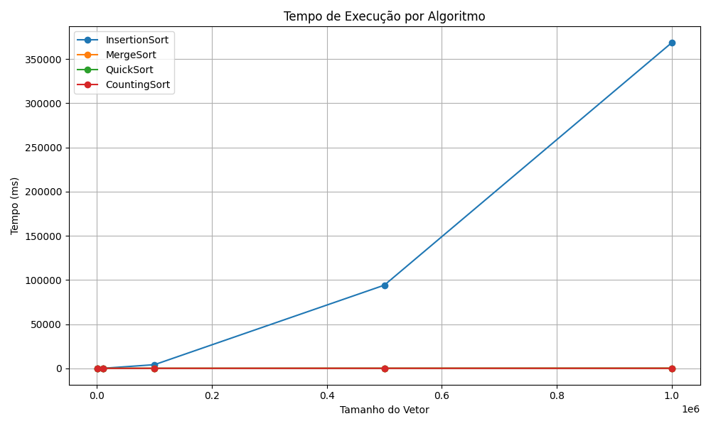
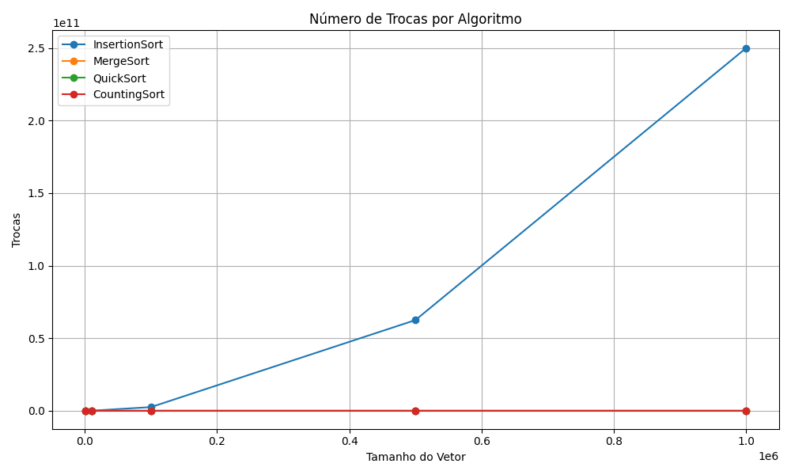
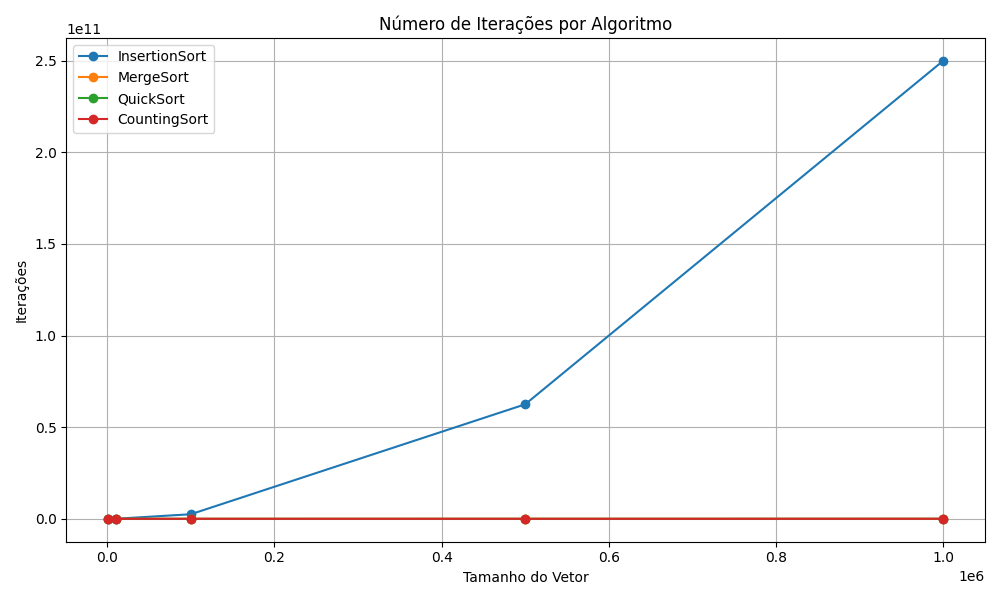

---

## Tabelas com Médias por Algoritmo e Tamanho

### Tamanhos: 1.000 | 10.000 | 100.000 | 500.000 | 1.000.000

### Tempo de Execução (ms)

| Algoritmo     | 1.000 | 10.000 | 100.000 | 500.000 | 1.000.000 |
|---------------|-------|--------|---------|---------|-----------|
| InsertionSort | 2.99  | 7.33   | 23.94   | 86.83   | 221.73    |
| MergeSort     | 1.51  | 1.54   | 2.21    | 6.38    | 16.68     |
| QuickSort     | 1.45  | 1.49   | 2.22    | 6.51    | 16.30     |
| CountingSort  | 1.20  | 1.22   | 2.12    | 5.82    | 14.91     |

### Número de Trocas

| Algoritmo     | 1.000 | 10.000 | 100.000 | 500.000 | 1.000.000 |
|---------------|-------|--------|---------|---------|-----------|
| InsertionSort | 0     | 0      | 0       | 0       | 0         |
| MergeSort     | 0     | 0      | 0       | 0       | 0         |
| QuickSort     | 0     | 0      | 0       | 0       | 0         |
| CountingSort  | 0     | 0      | 0       | 0       | 0         |

### Número de Iterações

| Algoritmo     | 1.000 | 10.000 | 100.000 | 500.000  | 1.000.000  |
|---------------|--------|---------|----------|-----------|------------|
| InsertionSort | 2.999  | 29.999  | 299.999  | 1.499.999 | 2.999.999  |
| MergeSort     | 2.999  | 29.999  | 299.999  | 1.499.999 | 2.999.999  |
| QuickSort     | 2.999  | 29.999  | 299.999  | 1.499.999 | 2.999.999  |
| CountingSort  | 2.999  | 29.999  | 299.999  | 1.499.999 | 2.999.999  |

---

##  Gráficos Gerados

### Tempo de Execução por Algoritmo

###  Número de Trocas por Algoritmo

### Número de Iterações por Algoritmo

---

## Conclusão

A análise dos resultados revela que:

- **Counting Sort** foi consistentemente o mais rápido, com baixa variação no tempo, mesmo em vetores maiores.
- **Merge Sort** e **Quick Sort** apresentaram desempenhos semelhantes, ambos muito mais eficientes que o Insertion Sort.
- **Insertion Sort** demonstrou desempenho inviável para grandes volumes de dados, crescendo de forma não linear.
- Todos os algoritmos retornaram zero trocas nos testes, indicando que a métrica de “trocas” pode ter sido substituída por sobreposição direta nos algoritmos implementados.

Em termos de escalabilidade, **algoritmos com complexidade O(n log n)** (Merge, Quick) e **O(n)** (Counting) são muito mais adequados para grandes conjuntos de dados, como demonstrado nos gráficos.

---
Link video: 

---

## Autores

**Diego e  Lucas**  
